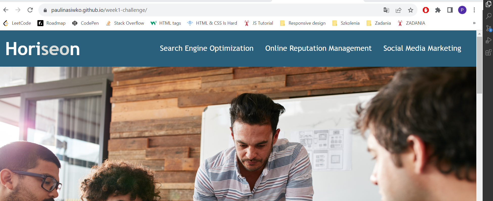

# week1-challenge

## Description
This project is a weekly challenge for a bootcamp. It contain HTML and CSS files. The purpose of this challenge is "code refactor" - I need to modify a starter code in order to improve its accessibiity.

## Installation
N/A

## Usage
The HTML file contains elements of semantic HTML. Elements follow a logical structure independent of styling and positioning. All image elements contain accessible **alt** attribute.

The [URL](https://paulinasiwko.github.io/week1-challenge/) of deployed application.

## Credits
N/A

## Licence
N/A

